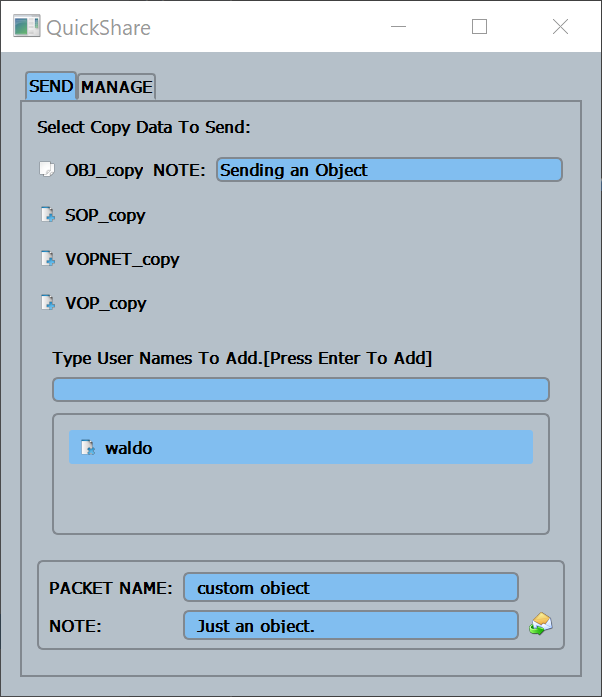
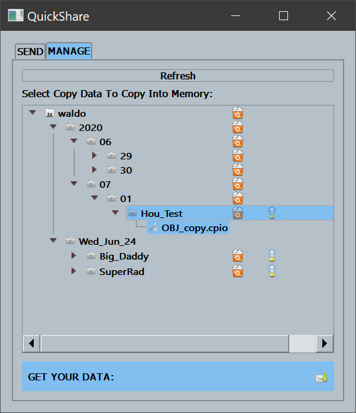
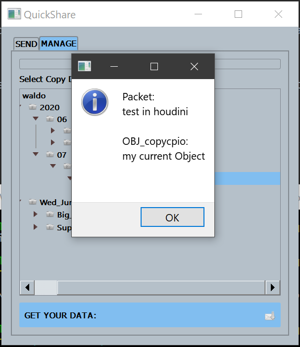
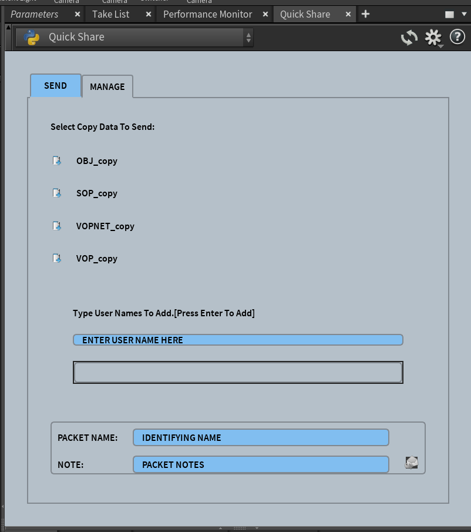

# QuickShare  v2.0.0
**QuickShare** is a Houdini copy/paste sharing application which allows user to share their current clipboard with another Houdini user.

#### Tested
This release of QuickShare was testing in the following configuration.
* Houdini Version: 18
* Python Version: 2.7
* OS: Windows 10

## Icons:
These are free icons that came from http://www.iconarchive.com.
If you want to change out your icons they have a very good selection.

## Interface Images:

## Configuration
QuickShare works by storing shared data in a common directory all users hav access to. 
* Once started QuickShare will create a folder in this directory if one does not exist.
* If  **QuickShare** can not create a directory it will prompt the user to create the appropriate directory.

#### Editing config.py
Before using the script you will need to edit the <code>**config.py**</code> file. The <code>**config.py**</code> file has two variables you 
will want to configure:

* **EXCLUDE_USERS**
    * Used to inform QuickShare that the assigned users should not be seen in the auto complete when searching for users.
    * Pay close attention to the syntax when excluding users.
* **SHARED_USERS_FOLDER**
    * This is the path to where QuickShare will store shared packets.
    * Make sure to add a <code>**r**</code> before your path.
      * Example: <code> r"/path/to/shared/drive/folder" </code>
</code>

## Adding QuickShare to Houdini
#### Install location
* Add the <code>**scripts/python/quick_share**</code> folder found in this repo to your local Houdini directory.
  * For example:
    * <code>C:\Users\waldo\Documents\houdini18.0\scripts\python\ **quick_share** </code>
* If you have configured Houdini to point towards a different scripts folder than the default, copy the same folder to 
your configured scripts dir.

#### Installing **QuickShare** to a python panel.
* Add the <code>**python_panels/qShare.pypanel**</code> to your local Houdini directory.
  * For example:
    * <code>C:\Users\waldo\Documents\houdini18.0\python_panels\ **qShare.pypanel** </code>
  * You should see quickshare in the panel as such:
  

#### Adding **QuickShare** to a shelf.
* Adding **QuickShare** to a shelf is straight forward.
    1. Create a new shelf button.
    2. Add the following code to the code body of the button (Make sure your language is set to python)
        * <pre> import quick_share
           quick_share.show() </pre>

#### Opening **QuickShare** command line.
If attempting to use **QuickShare** command line insure that you have:
1. Python installed. Ideally this is through a Conda env.
2. PySide2 installed. This can be done using pip.
* To open **QuickShare** via a command line:
    1. Open a shell
    2. Navigate to the <code>**scripts/python/quick_share**</code> directory.
    3. type: <code> python __init__.py </code>

## Usage
* **Sending Data** 
    1. Select node you want to copy, press Ctrl_C.
    2. Open **QuickShare**.
    3. Click the **SEND** tab.
    3. Select the icon next to the data you want to send. This will register the item to send.
    4. Add a note in the note field.
    5. Type a user name in the bar below the packets and hit enter to add the user.
    6. Add a name. This is what the recipient will see.
    7. Add a note. This is what the recipient will see if they click the light bulb icon in the manage tab.
    8. Press the mail delivery icon. You will be notified the package was sent.
    
* **Receiving Data**
    1. Open **QuickShare**
    2. Click the **MANAGE** tab.
    3. In the tree view navigate to the item you want to add to your scene.
    4. Select the item package (NOT THE INDIVIDUAL ITEMS IN THE PACKAGE)
    5. When you have a valid selection. The Icon next to **GET YOUR DATA** will activate.
    6. Press the Mail Delivery Icon next to **GET YOUR DATA**
    7. Ctrl_V into the appropriate view. You should see your selection show up in your scene.
        * Do this for every view type you have data for.

## Release Notes:
* v1.0.0
    * Original release of QuickShare.
* v2.0.0
    * Complete rewrite of QuickShare. 
    * New directory for storing shared data packets
        * the new structure is <Common Share Dir>\<user>\quickshare_data\<sender>\<year>\<month>\<day>\<share name>
        * v1.0.0 share data is still supported.
    * Simplified configuration.